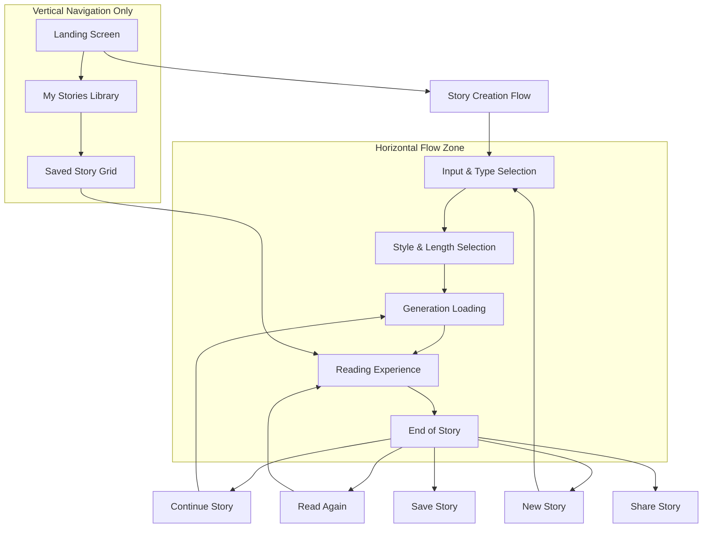
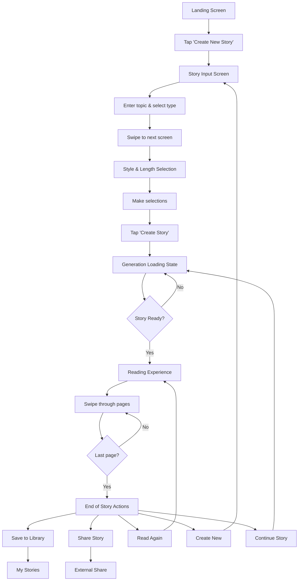
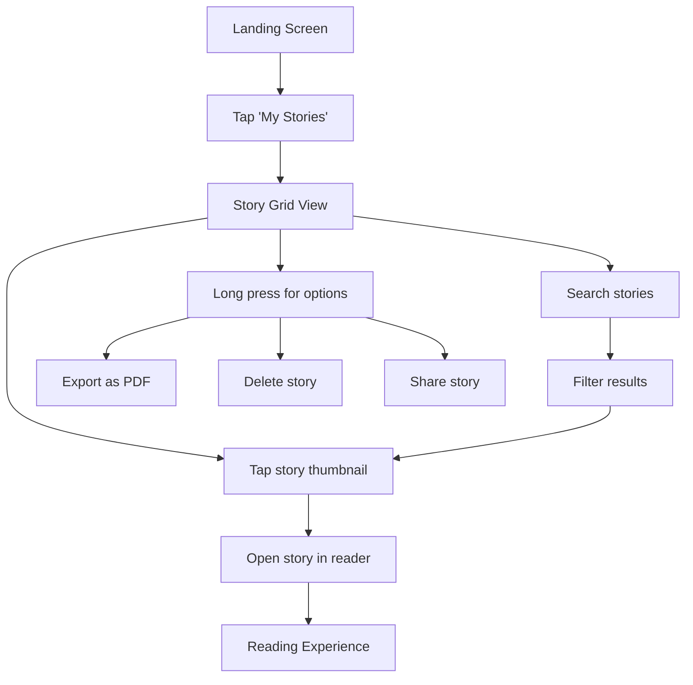

# Mayari UI/UX Specification

## Introduction

This document defines the user experience goals, information architecture, user flows, and visual design specifications for Mayari's user interface. It serves as the foundation for visual design and frontend development, ensuring a cohesive and user-centered experience that transforms screen time into valuable storytelling time.

### Overall UX Goals & Principles

### Target User Personas

- **Stressed Parent:** Working parents (25-40 years) who need quick solutions for children's questions and bedtime stories. Limited time, high stress, need instant gratification.
- **Engaged Caregiver:** Grandparents, babysitters, or stay-at-home parents who actively seek educational content and quality time activities with children.
- **Tech-Savvy Parent:** Millennial parents comfortable with digital tools who want to combine technology with traditional storytelling.

### Usability Goals

- **Instant Gratification:** Parents can generate a complete story in under 60 seconds
- **Child-Safe Interaction:** Children (2-5 years) can navigate the reading experience independently with simple swipe gestures
- **Zero Learning Curve:** New users can create their first story without any onboarding or tutorials
- **Offline Reliability:** Previously created stories work flawlessly without internet connection
- **Interruption Recovery:** App gracefully handles interruptions (calls, notifications) and returns to exact position

### Design Principles

1. **Magical Simplicity** - Feel like a digital storybook, not a complex app
2. **Horizontal Flow Primacy** - Minimize vertical scrolling; embrace page-turning metaphor
3. **Immersive Focus** - Remove all distractions during story consumption
4. **Instant Visual Feedback** - Every interaction provides immediate, clear response
5. **Child-Centric Design** - Large touch targets, simple gestures, forgiving interactions

### Change Log

| Date | Version | Description | Author |
| :--- | :------ | :---------- | :----- |
| 2024 | v1.0 | Initial specification based on PRD v1.0 | Sally (UX Expert) |

## Information Architecture (IA)

### Site Map / Screen Inventory

### Navigation Structure

**Primary Navigation:** Horizontal swipe-based navigation within story flow; vertical scroll only on landing and library screens

**Secondary Navigation:** Discrete exit points and action buttons positioned unobtrusively

**Breadcrumb Strategy:** Visual progress indicators (dots) during reading; no traditional breadcrumbs needed

## User Flows

### Story Creation & Reading Flow

**User Goal:** Create and read a personalized story from concept to completion

**Entry Points:** Landing screen "New Story" button

**Success Criteria:** User creates story, reads it completely, and saves or shares it

#### Flow Diagram

**Edge Cases & Error Handling:**

- Network failure during generation: Preserve user inputs, show retry with clear error message
- Generation timeout: Offer to try shorter story or different style
- Swipe gesture conflicts: Clear directional affordances, prevent accidental navigation
- Child accidentally exits: Confirm exit with parent-friendly verification

**Notes:** Flow designed to minimize decision fatigue while maintaining creative control

### Library Management Flow

**User Goal:** Browse, organize and access previously created stories

**Entry Points:** Landing screen "My Stories" button, post-creation save action

**Success Criteria:** User finds and opens desired story for reading

#### Flow Diagram

**Edge Cases & Error Handling:**

- Empty library state: Encouraging prompt to create first story
- Slow image loading: Progressive image loading with placeholders
- Storage quota exceeded: Smart cleanup suggestions and cloud storage prompts

## Wireframes & Mockups

**Primary Design Files:** To be created in Figma/v0 using generated prompts

### Key Screen Layouts

#### Landing Screen

**Purpose:** Welcome users and provide clear entry points to main functions

**Key Elements:**

- App title "Mayari" with Poppins font (36px, Bold, #2C3E50)
- Profile/User icon (top-right, rounded button with #F7F1E8 background)
- Magical background with floating elements (Moon, Sparkles, blurred circles)
- Central descriptive text: "Create magical bedtime stories with your child, one question at a time" (Georgia font)
- Two primary action buttons:
  - "New Story" (Primary button: Coral to Rose gradient, 52px height, with PlusCircle icon)
  - "My Stories" (Secondary button: Cream background, Soft Blue border, 48px height, with Library icon)

**Interaction Notes:** Vertical layout only; clear visual hierarchy guiding to primary action

#### Story Input Screen (Creation Flow - Page 1)

**Purpose:** Capture story theme and type with minimal friction

**Key Elements:**

- Page header: "What story shall we create?" (Poppins, 28px, Semibold)
- Large text input field for story topic (rounded corners, #7B9AE0 border on focus)
- Two story type cards with distinctive styling:
  - "Realistic Explanation" (blue accent with BrainCircuit icon)
  - "Fantasy Story" (purple accent with Sparkles icon)
- Visual selection feedback with border highlighting
- "Next" button (disabled until both fields completed)

**Interaction Notes:** Focus automatically on text input; swipe right or tap next to continue

#### Style & Length Selection (Creation Flow - Page 2)

**Purpose:** Allow style and length customization while maintaining simplicity

**Key Elements:**

- Page header: "Choose your style & length" (Poppins, 28px, Semibold)
- Four art style options with preview icons:
  - Peppa Pig Style, Pixi Book Style, Watercolor Style, Comic Style
  - Visual cards with selection feedback (#7B9AE0 border when selected)
- Three length options displayed as large numbered cards:
  - "8 pages", "12 pages", "16 pages" (each in rounded cards)
- "Create Story" button (Primary gradient button with Sparkles icon)
- Back navigation available

**Interaction Notes:** Single selection for each option; visual feedback for selections

#### Generation Loading Screen

**Purpose:** Entertain and inform during AI generation process

**Key Elements:**

- Central animated illustration area (Star and PenTool icons with CSS animations)
- Primary message: "The magic is happening..." (Poppins, 24px, Semibold)
- Secondary message: "A little spark of imagination becomes a story." (Georgia, 16px)
- Warm background (#FFF8F0) with centered layout
- No specific progress indicator (creates sense of magic vs. technical process)

**Interaction Notes:** No user interaction required; auto-advances when complete

#### Reading Experience Screen

**Purpose:** Provide immersive, distraction-free reading environment

**Key Elements:**

- Full-screen story image (covers entire viewport)
- Story text overlay: Georgia font, 24px, white with text shadow for readability
- Text positioned in lower area with proper padding
- Progress dots at bottom center (Accent Gold #F4D03F for current page, white/50% for remaining)
- Invisible swipe zones for left/right navigation
- No visible UI controls during reading for immersion

**Interaction Notes:** Swipe left/right for navigation; tap for navigation hints if needed

#### End of Story Screen

**Purpose:** Provide clear next actions and story management options

**Key Elements:**

- BookCopy icon and "The End" celebration (48px icon, Poppins 28px title)
- Subtitle: "A wonderful story for another time." (Georgia, 16px)
- Five action buttons in vertical layout:
  - "Read Again" (Secondary button with RefreshCw icon)
  - "New Story" (Secondary button with PlusCircle icon) 
  - "Continue Story" (Secondary button with PenTool icon)
  - "Save to My Stories" (Primary gradient button with Save icon)
- Cream background (#F7F1E8) for warm completion feeling

**Interaction Notes:** Clear button hierarchy with save as primary action; automatic return to horizontal flow

## Component Library / Design System

**Design System Approach:** Custom minimal design system optimized for the "magical book" experience

### Core Components

#### Story Card

**Purpose:** Represent saved stories in library grid

**Variants:** Standard, Featured (recently created), Loading placeholder

**States:** Default, Hover (desktop), Pressed, Loading

**Usage Guidelines:**
- Always include story thumbnail, title, and creation date
- Support both tap to open and long-press for options
- Maintain consistent aspect ratio across all cards

#### Swipe Navigation

**Purpose:** Enable intuitive page-turning interaction

**Variants:** Story pages, Creation flow screens

**States:** Default, Drag active, Snap animation, Disabled (during loading)

**Usage Guidelines:**
- Clear directional affordances when gesture is available
- Smooth, physics-based animations
- Support both swipe and tap-edge navigation

#### Progress Indicators

**Purpose:** Show reading progress without visual clutter

**Variants:** Dots (reading), Steps (creation), Loading (generation)

**States:** Current, Completed, Upcoming, Loading

**Usage Guidelines:**
- Always positioned consistently at bottom
- Sized appropriately for child interaction
- Never interfere with main content

#### Story Generation Button

**Purpose:** Primary CTA for story creation

**Variants:** Default, Processing, Success, Error

**States:** Default, Hover, Active, Disabled, Loading

**Button Components (from Style Guide)**

**Primary Button (Story Creation)**
- Background: Linear gradient (Accent Coral #FF8A65 to Accent Rose #F1948A)
- Text: White (#FFFFFF), Poppins Medium 16px
- Height: 52dp
- Corner Radius: 26dp (fully rounded)
- Padding: 24dp horizontal
- Shadow: 0px 4px 12px rgba(255, 138, 101, 0.3)

**Secondary Button (Navigation)**
- Background: Secondary Cream (#F7F1E8)
- Text: Primary Deep Navy (#2C3E50), Poppins Medium 16px
- Border: 2px Primary Soft Blue (#7B9AE0)
- Height: 48dp
- Corner Radius: 24dp

**Magic Button (Special Actions)**
- Background: Linear gradient (Primary Soft Blue #7B9AE0 to Secondary Lavender #D4C5F0)
- Text: White (#FFFFFF), Poppins Medium 16px
- Height: 56dp
- Corner Radius: 28dp

**Usage Guidelines:**
- Most prominent element on creation screens
- Clear loading states with progress indication
- Error states include actionable recovery options

## Branding & Style Guide

### Visual Identity

**Brand Guidelines:** Warm, magical, approachable aesthetic that appeals to both parents and children

### Color Palette

**Primary Colors**
| Color Type    | Hex Code | Usage                                    |
| :------------ | :------- | :--------------------------------------- |
| **Primary Warm** | #FFF8F0  | Main light background, warm paper-like feeling |
| **Primary Soft Blue** | #7B9AE0  | Primary brand color for interactive elements, like twilight sky |
| **Primary Deep Navy** | #2C3E50  | For primary text and headers, readable but gentle |

**Secondary Colors**
| Color Type    | Hex Code | Usage                                    |
| :------------ | :------- | :--------------------------------------- |
| **Secondary Peach** | #FFB4A1  | For warm accents and hover states |
| **Secondary Lavender** | #D4C5F0  | For gentle backgrounds and secondary elements |
| **Secondary Cream** | #F7F1E8  | For card backgrounds and content areas |

**Accent Colors**
| Color Type    | Hex Code | Usage                                    |
| :------------ | :------- | :--------------------------------------- |
| **Accent Gold** | #F4D03F  | For magical elements, stars, and highlights |
| **Accent Rose** | #F1948A  | For loving, warm interactive elements |
| **Accent Mint** | #A8E6CF  | For success states and positive actions |
| **Accent Coral** | #FF8A65  | For playful elements and CTAs |

**Functional Colors**
| Color Type    | Hex Code | Usage                                    |
| :------------ | :------- | :--------------------------------------- |
| **Success Green** | #81C784  | For completed stories, successful saves |
| **Warning Amber** | #FFB74D  | For gentle alerts and notifications |
| **Error Rose** | #F48FB1  | For soft error states, non-alarming |
| **Neutral Gray** | #95A5A6  | For secondary text and disabled states |

**Story Mode Colors**
| Color Type    | Hex Code | Usage                                    |
| :------------ | :------- | :--------------------------------------- |
| **Realistic Mode** | #5DADE2  | Calming blue for educational content |
| **Fantasy Mode** | #BB8FCE  | Magical purple for imaginative stories |

### Typography

**Font Families:**

- **Primary:** Poppins (Rounded, friendly, highly readable - UI elements, metadata)
- **Secondary:** Comic Neue (For playful elements and child-focused text)
- **Reading:** Georgia (For story text - familiar, comfortable reading)

**Font Weights:**
- Light: 300 (For subtle text)
- Regular: 400 (Body text)
- Medium: 500 (Emphasis)
- Semibold: 600 (Headings)
- Bold: 700 (Strong emphasis)

**Text Styles**

**Headings**
| Element | Size/Line Height | Weight | Letter Spacing | Color | Usage |
|:--------|:----------------|:-------|:---------------|:------|:------|
| H1 | 36px/42px | Semibold | -0.2px | Primary Deep Navy | Main app title and major section headers |
| H2 | 28px/34px | Semibold | -0.1px | Primary Deep Navy | Story titles and section headers |
| H3 | 22px/28px | Medium | 0px | Primary Deep Navy | Subsection headers and card titles |

**Body Text**
| Element | Size/Line Height | Weight | Letter Spacing | Color | Usage |
|:--------|:----------------|:-------|:---------------|:------|:------|
| Body Large | 18px/26px | Regular | 0px | Primary Deep Navy | Primary interface text and descriptions |
| Body | 16px/24px | Regular | 0px | Primary Deep Navy | Standard UI text and form labels |
| Body Small | 14px/20px | Regular | 0.1px | Neutral Gray | Supporting text and metadata |

**Story Text**
| Element | Size/Line Height | Weight | Font | Usage |
|:--------|:----------------|:-------|:-----|:------|
| Story Reading | 24px/32px | Regular | Georgia | Text embedded in story images - large and clear for young children |
| Story Caption | 20px/28px | Regular | Georgia | Alternative story text size for longer content |

**Special Text**
| Element | Size/Line Height | Weight | Font | Color | Usage |
|:--------|:----------------|:-------|:-----|:------|:------|
| Button Text | 16px/24px | Medium | Poppins | - | All interactive button labels |
| Magic Text | 18px/24px | Medium | Comic Neue | Primary Soft Blue | For magical, playful interface elements |
| Metadata | 12px/18px | Regular | Poppins | Neutral Gray | Timestamps, story details, technical info |

### Iconography

**Icon Library:** Lucide React with custom illustrations for story-specific elements

**Usage Guidelines:** 
- Consistent stroke width (2px)
- Rounded corners for friendly appearance
- Custom illustrations for story categories and actions
- Standard size: 20px for buttons, 24px for headers
- Color: Primary Deep Navy (#2C3E50) for most icons

### Spacing & Layout

**Grid System:** 8px base unit with 16px, 24px, 32px, 48px common increments

**Spacing Scale (aligned with Tailwind CSS):** 
- 1: 4px
- 2: 8px 
- 4: 16px
- 6: 24px
- 8: 32px
- 12: 48px
- 16: 64px

**Component Spacing:**
- Button padding: 24px horizontal, 16px vertical
- Card padding: 24px all sides
- Screen margins: 24px horizontal

## Accessibility Requirements

### Compliance Target

**Standard:** WCAG 2.1 AA compliance with enhanced support for children and reading disabilities

### Key Requirements

**Visual:**

- Color contrast ratios: 4.5:1 for normal text, 7:1 for story text
- Focus indicators: Clear 3px outline with Primary Soft Blue (#7B9AE0)
- Text sizing: Minimum 16px for UI, 24px for story content (Georgia font)
- Touch targets: Minimum 44px×44px, 52px×52px preferred for primary buttons

**Interaction:**

- Keyboard navigation: Full keyboard support for all interactive elements
- Screen reader support: Comprehensive ARIA labels and live regions
- Touch targets: Minimum 52px×52px for primary actions, 48px×48px for secondary
- Swipe gestures: Minimum 44px touch zones for story navigation
- Child-friendly: Large, forgiving touch areas with visual feedback

**Content:**

- Alternative text: Descriptive alt text for all story illustrations
- Heading structure: Logical hierarchy with proper heading tags
- Form labels: Clear, descriptive labels for all form inputs

### Testing Strategy

- Automated testing with axe-core
- Manual testing with screen readers (NVDA, VoiceOver)
- User testing with parents of children with disabilities
- Color blindness testing with multiple simulators

## Responsiveness Strategy

### Breakpoints

| Breakpoint | Min Width | Max Width | Target Devices           |
| :--------- | :-------- | :-------- | :----------------------- |
| Mobile     | 320px     | 767px     | Phones (primary target)  |
| Tablet     | 768px     | 1023px    | iPads, large phones      |
| Desktop    | 1024px    | 1439px    | Laptops, small monitors  |
| Wide       | 1440px    | -         | Large monitors, TVs      |

### Adaptation Patterns

**Layout Changes:** 
- Mobile: Single column, full-screen story view
- Tablet: Optimized for landscape reading, larger touch targets
- Desktop: Centered content with maximum widths, mouse interaction support

**Navigation Changes:**
- Mobile: Swipe-primary with tap affordances
- Desktop: Click navigation with keyboard support
- All: Consistent gesture behavior across devices

**Content Priority:**
- Story content always takes priority
- UI elements scale appropriately to maintain readability
- Progressive enhancement for larger screens

**Interaction Changes:**
- Touch-first design with mouse/keyboard support
- Hover states only on devices that support them
- Gesture hints adapt to input capabilities

## Animation & Micro-interactions

### Motion Principles

- **Purposeful:** Every animation serves a functional purpose
- **Smooth:** 60fps animations with appropriate easing
- **Respectful:** Reduced motion for accessibility and battery life
- **Magical:** Enhance the storybook feel without distraction

### Key Animations

- **Page Transitions:** Smooth slide transitions between story pages (300ms, ease-out)
- **Story Generation:** Engaging loading animation during AI generation (continuous loop)
- **Button Feedback:** Subtle scale and color changes for interactions (150ms, ease-in-out)
- **Swipe Affordance:** Gentle hint animation for swipe gestures (1000ms, ease-in-out)
- **Story Complete:** Celebration animation at story completion (500ms, bounce)

## Performance Considerations

### Performance Goals

- **Page Load:** First Contentful Paint under 1.5 seconds
- **Interaction Response:** Touch/click response under 100ms
- **Animation FPS:** Consistent 60fps for all animations
- **Story Generation:** User feedback within 2 seconds, complete story under 45 seconds

### Design Strategies

- Progressive image loading with optimized placeholders
- Lazy loading for story library grid
- Optimized illustration formats (WebP with JPEG fallback)
- Minimal JavaScript for core reading experience
- Aggressive caching strategy for generated content

## Next Steps

### Immediate Actions

1. **Create detailed wireframes** in Figma for all identified screens
2. **Generate AI frontend prompts** using v0/Lovable for rapid prototyping
3. **Develop interactive prototype** to validate swipe interactions and flow

### Design Handoff Checklist

- [x] All user flows documented and validated
- [x] Component inventory complete with specifications
- [x] Accessibility requirements defined and comprehensive
- [x] Responsive strategy clear with specific breakpoints
- [x] Brand guidelines incorporated throughout
- [x] Performance goals established with specific metrics
- [ ] Visual designs created in design tool
- [ ] Interactive prototype built and tested
- [ ] Developer handoff documentation prepared 