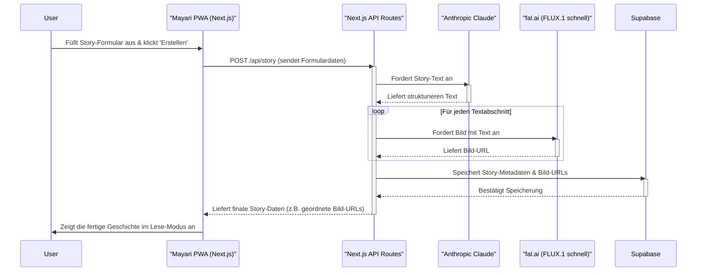
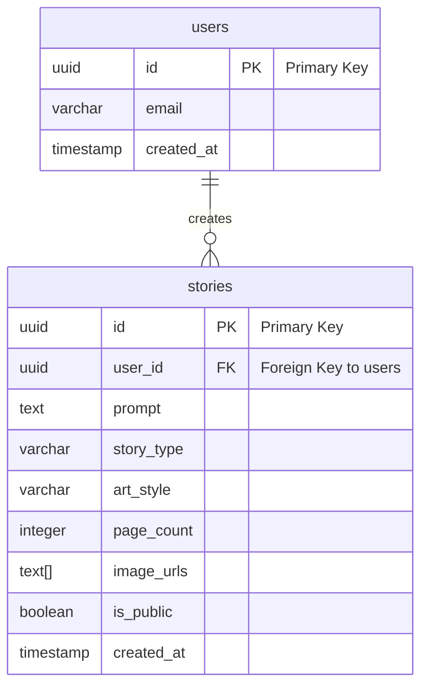

# Finales System Design Document (SDD) für "Mayari"

### 1. High-Level Systemarchitektur: Story-Erstellung

Dieses Diagramm zeigt den Hauptprozess der Geschichtenerstellung und die Interaktion der Systemkomponenten.

### 2. Datenmodell / Datenbank-Schema

#### Tabelle: `users`
(Verwaltet von Supabase Authentication)

| Spaltenname | Datentyp | Beschreibung |
| :--- | :--- | :--- |
| `id` | `uuid` | Primärschlüssel. Eindeutige ID für jeden Nutzer. |
| `email` | `varchar` | E-Mail-Adresse des Nutzers (für den Login). |
| `created_at` | `timestamp`| Zeitstempel der Erstellung. |

#### Tabelle: `stories`

| Spaltenname | Datentyp | Beschreibung |
| :--- | :--- | :--- |
| `id` | `uuid` | Primärschlüssel. Eindeutige ID für jede Geschichte. |
| `user_id` | `uuid` | Fremdschlüssel, der auf `users.id` verweist. |
| `prompt` | `text` | Der ursprüngliche Text-Prompt des Nutzers. |
| `story_type` | `varchar` | Typ der Geschichte, z.B. 'Erklärung' oder 'Fantasie'. |
| `art_style` | `varchar` | Der gewählte visuelle Stil, z.B. 'Peppa Pig Style'.|
| `page_count`| `integer` | Anzahl der Seiten (z.B. 8, 12, 16). |
| `image_urls`| `text[]` | Geordnetes Array der Seiten-Bild-URLs. |
| `text_content`| `text[]` | Geordnetes Array der Seiten-Texte (Overlay). |
| `is_public` | `boolean` | `true`, wenn die Geschichte öffentlich geteilt werden kann. Standard: `false`.|
| `created_at`| `timestamp`| Zeitstempel der Erstellung. |

#### Entity Relationship Diagram (ERD)

### 3. API-Endpunkt-Spezifikation

#### Endpunkt 3.1: Eine neue Geschichte erstellen
* **Route:** `POST /api/stories/generate`
* **Beschreibung:** Nimmt die Nutzereingaben entgegen, erzeugt strukturierte Seiten (Text) und generiert für jede Seite ein Bild; speichert konsistente Arrays (`text_content[]`, `image_urls[]`).
* **Authentifizierung:** Erforderlich.
* **Request Body:** JSON-Objekt mit `userInput`, `storyContext: { storyType, artStyle, pageCount }`.
* **Success Response (`201 Created`):** `{ success, title, text_content: string[], image_urls: string[] }`.
* **Error Responses:** `400` (Ungültige Eingabe), `401` (Nicht autorisiert), `500` (Serverfehler).

#### Endpunkt 3.2: Geschichten eines Nutzers abrufen
* **Route:** `GET /api/stories`
* **Beschreibung:** Ruft eine Liste der Geschichten des eingeloggten Nutzers ab.
* **Authentifizierung:** Erforderlich.
* **Success Response (`200 OK`):** Gibt ein Array von Story-Metadaten zurück.
* **Error Responses:** `401` (Nicht autorisiert).

#### Endpunkt 3.3: Eine einzelne Geschichte abrufen
* **Route:** `GET /api/stories/{id}`
* **Beschreibung:** Ruft die vollständigen Daten einer einzelnen Geschichte ab.
* **Authentifizierung:** Nicht erforderlich (interne Logik prüft auf `is_public` oder Eigentümerschaft).
* **Success Response (`200 OK`):** Gibt das vollständige Story-Objekt zurück.
* **Error Responses:** `404` (Nicht gefunden / Keine Berechtigung).

#### Endpunkt 3.4: Eine Geschichte zum Teilen freigeben
* **Route:** `POST /api/stories/{id}/share`
* **Beschreibung:** Setzt das `is_public`-Flag einer Geschichte auf `true`.
* **Authentifizierung:** Erforderlich (nur für eigene Geschichten).
* **Success Response (`200 OK`):** Gibt die öffentliche URL zur Geschichte zurück.
* **Error Responses:** `401` (Nicht autorisiert), `403` (Verboten), `404` (Nicht gefunden).

---